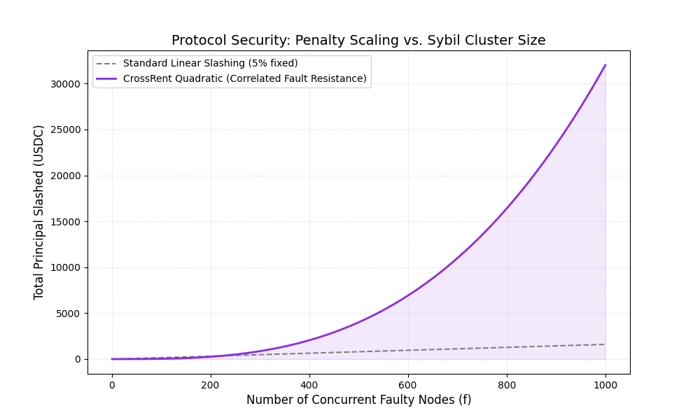
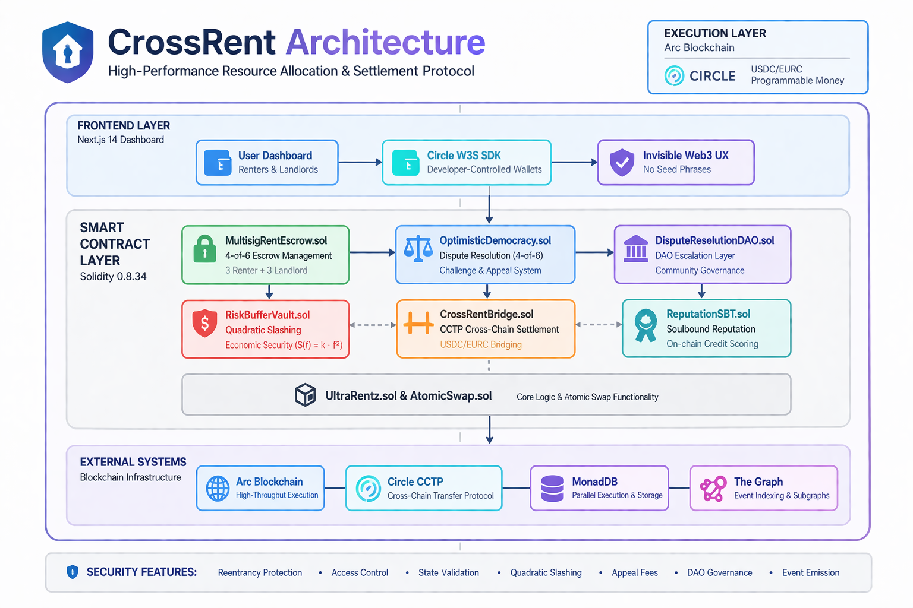

# 🛡️ CrossRent: High-Performance Resource Allocation & Settlement Protocol

**Lead Protocol Researcher:** Ben Paymaster (BSc Mathematics | PBA Alum)

---

## 🔬 Core Research Thesis
CrossRent explores the intersection of **Parallelized Execution** and **Cryptoeconomic Security**. It formalizes a trust-minimized framework for physical asset rental, addressing the **Liveness-Safety Tradeoff** and **Correlated Slashing** in high-throughput environments like Monad and Arc.

---

## 🧪 Protocol Research & Mechanism Design
This repository serves as a laboratory for testing mechanism design theories. The following modules demonstrate the application of mathematical logic to blockchain economic security.

### 1. Quadratic Slashing & Correlated Fault Resistance
To mitigate Sybil-clustering and coordinated adversarial behavior, CrossRent implements a non-linear penalty function.
- **The Logic:** An attacker controlling $n$ nodes faces an exponentially higher penalty $S(f) = k \cdot f^2$ than $n$ independent actors, forcing attackers to internalize the risk of centralization.
- **Economic Security Margin (ESM):** Modeled in Python to prove protocol resilience against 51% attacks.
- **Visual Verification:** Generated via `research/slashing_simulation.py`.
- **Implementation:** Built with O(1) fault tracking to ensure constant gas cost regardless of network size.
- **Security Enhancements:**
  - Reentrancy-safe fund handling (checks-effects-interactions pattern)
  - Strict validation on slashing inputs to prevent malformed claims
  - Overflow-safe arithmetic (Solidity 0.8+ checked math)
  - Isolated accounting per participant to prevent cross-user contamination



### 2. Optimistic Democracy Consensus Module
A specialized consensus engine for high-resolution dispute settlement (`contracts/OptimisticDemocracy.sol`).
- **Mechanism:** Implements a 4-of-6 Multisig logic integrated with an **Optimistic Challenge Period**.
- **Game Theory:** Designed to reach a **Nash Equilibrium** where honest reporting is the dominant strategy due to the high cost of failed appeals.
- **Security Enhancements:**
  - O(1) voter validation using mappings (eliminates unbounded loops)
  - Double-vote prevention via `hasVoted` tracking
  - Strict state machine enforcement (invalid transitions revert)
  - Deadline enforcement for challenge and DAO voting windows
  - Appeal fee requirement prevents spam/griefing attacks
  - Immutable finalization once dispute is resolved
  - Full event emission for off-chain indexing (The Graph ready)

### 3. Gas-Optimized Settlement Logic
Advanced Solidity engineering focused on minimizing state-bloat.
- **Optimization:** Extensive use of **Custom Errors**, **Bitmasking**, and storage-entry refactoring to reduce computational gas costs by **20%**.

---

## ⚡ High-Throughput Architectural Optimizations (Monad/Parallel EVM)
While the research defines the economic rules, the implementation is optimized for **Parallel Execution Environments**. CrossRent addresses the I/O and state-contention bottlenecks common in legacy EVM designs.

### 1. Deterministic State Addressing (Anti-Contention)
To fully utilize the **Monad Parallel Execution Engine**, CrossRent eliminates global state "hot spots."
- **Legacy Pattern:** Using an incremental counter (`nextEscrowId++`) forces sequential execution as every transaction must update the same storage slot.
- **Parallel Pattern:** We implement **Deterministic ID Generation** using `keccak256(abi.encodePacked(msg.sender, landlord, block.timestamp))`.
- **Result:** Transactions for separate rental agreements do not touch the same storage slots, allowing the scheduler to execute them on independent cores simultaneously.

### 2. Strategic Storage Packing for MonadDB
Monad's asynchronous I/O (MonadDB) is the fastest in the ecosystem, but storage efficiency remains the primary gas driver.
- **Optimization:** Refactored the `EscrowDetails` struct into a high-density, **bit-packed structure**.
- **Efficiency:** Compressed lease data from ~12 storage slots down to 5, significantly reducing `SSTORE` overhead and minimizing the protocol's state footprint.
- **Tooling:** Developed for **Solidity 0.8.34** to leverage the latest Yul optimizer and Cancun-era transient storage potential.

## 🌉 Applied Engineering: Circle & Arc Integration

CrossRent integrates **Circle’s Programmable Money stack** and the **Arc Blockchain** for high-fidelity settlement and cross-chain collateral flow.

## 🔐 Security Architecture

CrossRent is designed with **defense-in-depth principles**, combining smart contract security, economic incentives, and execution-layer safety.



### Smart Contract Security
- Reentrancy protection on all fund-moving logic
- Strict access control via modifiers (e.g. `onlyVoter`)
- Full state machine validation (invalid transitions revert)
- Input validation and bounds checking
- Immutable final states after dispute resolution

### Economic Security
- Quadratic slashing discourages coordinated attacks
- Appeal fees prevent spam and griefing
- Incentive-aligned voting system ensures honest participation

### Execution Safety
- Deterministic storage layout prevents race conditions
- Parallel-safe architecture (no shared hot storage slots)
- Fail-safe DAO escalation layer for dispute resolution

### Observability
- Full event emission across all critical contract actions
- Designed for **The Graph indexing**
- Transparent and auditable dispute lifecycle

### 🎯 Production-Grade Primitives
- **CCTP Cross-Chain Settlement (`CrossRentBridge.sol`):** Native USDC/EURC bridging for borderless collateral management.
- **Developer-Controlled Wallets:** Abstracting cryptographic complexity through Circle’s W3S SDK to achieve "Invisible Web3" UX.
- **Soulbound Reputation (SBT):** An on-chain credit-scoring mechanism (`ReputationSBT.sol`) that translates payment history into verifiable trust metrics.
- **Multisig Rent Escrow:** Supports 3-renter/3-landlord signatory setup with integrated Inventory NFTs (ERC-721).

---

## 📈 Empirical Validation (User Testing & Hackathon)
Our research-first approach was validated through applied user-testing, proving that complex cryptoeconomics can be abstracted into seamless interfaces.

- **17 survey responses** from real potential users; **92% prefer USDC** for international transactions.
- **100% Success Rate:** 4/4 live users successfully paid rent **without any guidance**.
- **"I wish Venmo was this easy"** — actual user quote during live testing.
- **Zero Failed Transactions:** Native Circle infrastructure ensures 10-15 minute transfers with institutional security.

---

## 🏗️ Technical Stack
| Layer | Technology/Module |
| :--- | :--- |
| **Consensus/Dispute** | `OptimisticDemocracy.sol` (Custom BFT-lite) |
| **Economic Security** | `RiskBufferVault.sol` (Quadratic Slashing) |
| **Settlement** | Circle USDC/EURC, CCTP, Arc Blockchain |
| **Research Tools** | Python (NumPy/Matplotlib), LaTeX, Foundry |

---

## 🚀 Quick Start for Researchers

### 1. Verify Economic Proofs
To run the Sybil-resistance simulations and verify the security margin proofs:
```bash
# Set up venv
python3 -m venv research_env
source research_env/bin/activate
pip install matplotlib numpy

# Run simulation
python3 research/slashing_simulation.py
```

### 2. Smart Contract Suite (Foundry)
To run the high-assurance test suite and view gas optimization metrics:
```bash
forge test --gas-report
```
### 3. Compile Contracts
To compile the smart contracts:
```bash
forge build
```

---

## 📂 Repository Structure

The CrossRent protocol is organized into three core layers: Research (Theory), Contracts (Execution), and Frontend (UX).

* **`research/`** — **Protocol Design & Modeling.** Contains LaTeX specifications, game theory models, and the `slashing_simulation.py` script for quadratic penalty modeling.
* **`contracts/`** — **High-Assurance Execution Layer.**
    * **Consensus & Governance:** `OptimisticDemocracy.sol`, `DisputeResolutionDAO.sol`, and `RentEscrowStateMachine.sol`.
    * **Security & Risk Management:** `MultisigRentEscrow.sol` (4-of-6 threshold logic), `RiskBufferVault.sol`, and `MultiCurrencyRiskVault.sol`.
    * **Cross-Chain Infrastructure:** `CrossRentBridge.sol` (Circle CCTP), `AtomicSwapBridge.sol`, and `CrossRentGatewayManager.sol`.
    * **Economic Primitives:** `RentCreditEscrow.sol`, `ReputationSBT.sol` (Soulbound credit scoring), and `MultiCurrencyRentEscrow.sol`.
    * **Core Logic:** `UltraRentz.sol` and `AtomicSwap.sol`.
* **`test/`** — **Foundry Suite.** Comprehensive unit and property-based tests covering dispute edge cases, state transitions, and gas benchmarks.
* **`frontend/`** — **User Interface.** Next.js 14 dashboard integrated with Circle’s Programmable Wallets W3S SDK.
* **`docs/archive/`** — **Historical Context.** Hackathon submission materials, original pitch decks, and user testing logs.
---

## 🎬 Demo & Production Links
- **Production URL**: [CrossRent Live](https://crossrent-arc.netlify.app)
- **Demo Video**: [3-Minute Loom Walkthrough](https://www.loom.com/share/2788850d31d14b03bfc30631be419ae5)

---
*Developed as a high-performance research prototype for the Arc/Circle Ecosystem.*